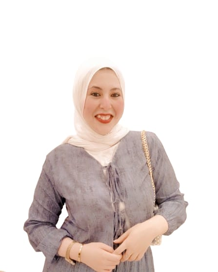

  

<h1 align="center">Basant Mohamed Alsmahy</h1>

Data Analyst | Excel • Power BI • Python • Tableau

📊 Transforming data into clear insights that drive smarter decisions.

---

## 🧑‍💻 About Me
Data Analyst with hands-on experience in Excel, Python, Power BI, and Tableau.  
Bachelor of Arts in Surveying, Mapping and GIS from Mansoura University (2019-2023).  
Passionate about turning complex datasets into actionable business insights and clear data stories.

---

## 🛠 Skills

- **Data Analysis & Visualization:** Excel (Pivot Tables, VLOOKUP, Charts), Power BI, Tableau  
- **Programming & Data Handling:** Python (Pandas, NumPy, Matplotlib, Seaborn), SQL  
- **GIS & Mapping:** ArcGIS, QGIS  
- **Dashboard & Reporting:** KPI Dashboards, Data Storytelling  
- **Soft Skills:** Problem Solving, Critical Thinking, Communication  

---

## 💼 Experience

**Freelance Data Analyst** *(2025 – Present)*  
- Delivered Excel, Power BI, and Tableau projects across multiple platforms.  
- Conducted data cleaning, trend analysis, KPI reporting, and created actionable dashboards.

**Data Analyst Intern** – Digital Egypt Pioneers Initiative *(06/2025 – Present)*  
- Developed interactive dashboards for performance tracking.  
- Applied data storytelling techniques to present insights clearly.

**GIS & Surveying Specialist** – Arab Contractors Company *(11/2024)*  
- Collected, analyzed, and visualized spatial data for infrastructure projects.  
- Created detailed maps and reports using GIS tools.

---

## 📊 Projects

### FIFA World Cup Data Analysis

- Historical analysis (1930–2014) using Excel: trends, team performance, pivot tables.  
- [View on GitHub](https://github.com/basantalsmahy3/FIFA_WorldCup_Analysis)

### Supply Chain Dataset Analysis

- End-to-end supply chain analysis using Python, SQL, Power BI, and Tableau.  
- [View on GitHub](https://github.com/basantalsmahy3/Supply-Chain-Dataset-Analysis-Group-4)

### Tableau Sales Dashboard

- Interactive sales dashboard with KPIs, trends, and regional analysis.  
- [View on GitHub](https://github.com/basantalsmahy3/Sales_Data_Analysis_Tableau_Dashboard)

### Online Courses Dataset Analysis

- Excel analysis of course pricing, categories, and popularity trends.  
- [View on GitHub](https://github.com/basantalsmahy3/Online-Courses-Dataset-Analysis-Excel-/tree/main)

---

## 🌐 Connect with Me

  <a href="https://www.freelanceyard.com/ar/account/profile" target="_blank">
     FreelanceYard
  </a>
  <a href="https://khamsat.com/user/basant_alsmahy01" target="_blank">
     Khamsat
  </a>
  <a href="https://mostaql.com/u/Basant_02" target="_blank">
     Mostaql
  </a>
  <a href="https://nafezly.com/u/basant_alsmahy" target="_blank">
     Nafezly
  </a>
  <a href="https://wa.me/message/C2RI5ZRDPCGTP1" target="_blank">
     WhatsApp
  </a>

📧 Email: <a href="mailto:basantalsmahy3@gmail.com">basantalsmahy3@gmail.com</a> |  
📱 Phone: <a href="tel:+201062613644">01062613644</a> |  
🔗 LinkedIn: <a href="https://www.linkedin.com/in/basant-alsmahy/">basant-alsmahy</a>

---

💻 <a href="https://basantalsmahy3.github.io/portfolio/" target="_blank">View My Full Portfolio</a>

© 2025 Basant Mohamed Alsmahy. All rights reserved.
