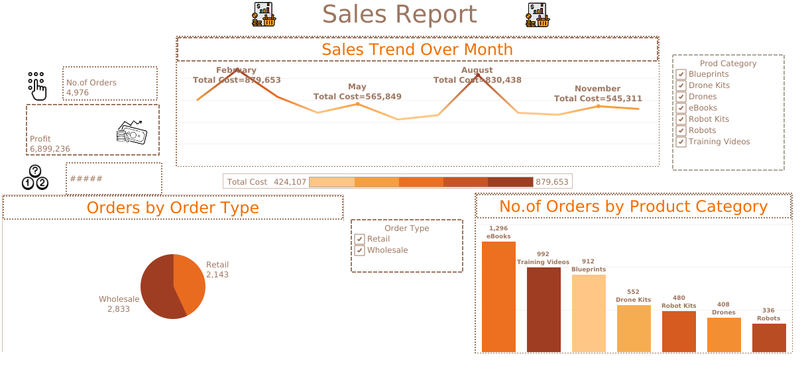
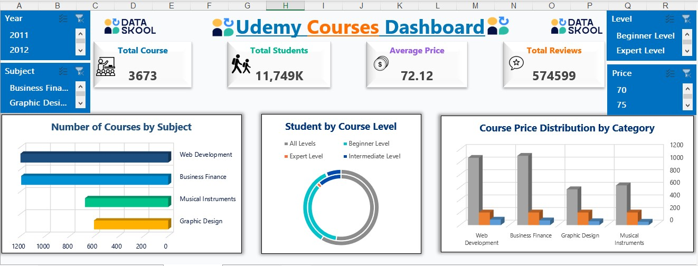

# 📊 Basant Mohamed Alsmahy – Data Analyst Portfolio

Welcome to my personal portfolio repository.  
This website showcases my data analytics projects using **Excel, Power BI, Python, SQL, and Tableau**.

---

## 🔥 Featured Projects

### 1️⃣ FIFA World Cup Data Analysis (1930–2014)
**Tools:** Excel  
- Data cleaning  
- Pivot tables  
- Team performance analysis  
- Tournament trends  

📸 **Images:**  
`/images/projects/fifa/`  

---

### 2️⃣ Supply Chain Dataset Analysis
**Tools:** Python • SQL • Power BI  
- Cleaning & preprocessing  
- Forecasting  
- KPI dashboard  
- Data visualization  

📸 **Images:**  
`/images/projects/supply-chain/`  

---

### 3️⃣ Tableau Sales Dashboard
**Tools:** Tableau  
- Sales trends  
- Regional analysis  
- KPIs  
- Interactive dashboard  

📸 **Images:**  
`/images/projects/tableau-sales/`  

---

### 4️⃣ Online Courses Dataset Analysis
**Tools:** Excel  
- Course popularity  
- Pricing analysis  
- Category distribution  
- Trend insights  

📸 **Images:**  
`/images/projects/online-courses/`  

---

## 🌐 Live Portfolio Website  
The website is deployed using GitHub Pages (or any hosting you choose).

---

## 📬 Contact  
- **Email:** basantalsmahy3@gmail.com  
- **LinkedIn:** basant-alsmahy  
- **GitHub:** basantalsmahy3  
- **Platforms:** Khamsat – Mostaql – Nafezly – FreelanceYard  

---

